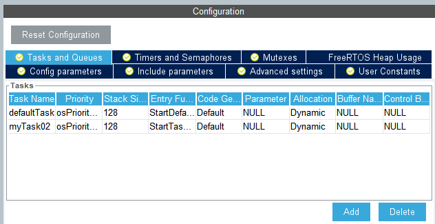

## Lab-2 Report

### Objective
1. Know what is *RTOS*.
2. Know the basic idea of *RTOS*.
3. Know how to make a simple project with *RTOS* in *STM32CubeIDE*.

### Task Description
FreeRTOS is a mini real-time operating system kernel. As a lightweight operating system, its functions include: task management, time management, semaphore, message queue, memory management, recording function, software timer, coroutine, etc., which can basically meet the needs of smaller systems.
This task is achieving different frequency of LED flashing through freeRTOS.
#### 1. Append Task
Task should be added by `.ioc` file:

From graph above, 2 tasks have been added to the project, then code will be generated automatically:
```C
void StartDefaultTask(void *argument)
{
  for(;;)
  {
    HAL_GPIO_TogglePin(GPIOB, GPIO_PIN_7);
    osDelay(500);
  }
}
```
This is the first task which controls blue LED.
```C
void StartTask02(void *argument)
{
  for(;;)
  {
    HAL_GPIO_TogglePin(GPIOB, GPIO_PIN_14);
    osDelay(1000);
  }
}
```
This is the second task which controls red LED.
<br></br> 
It is easily found that the 2 tasks are running simultaneously.